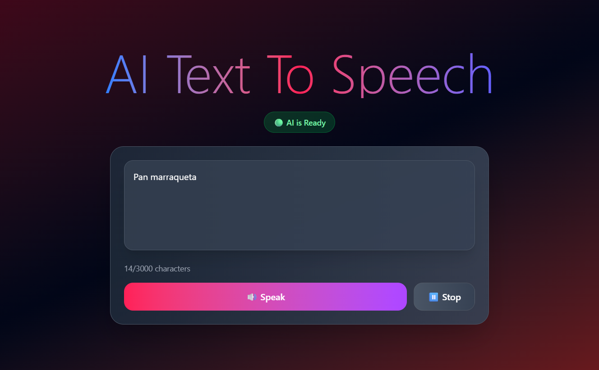

# AI Text To Speech

This project is a web-based application that converts text into speech using Artificial Intelligence. It's built with modern web technologies and leverages Puter.js to handle AI functionalities in a serverless fashion.

## Features

*   Real-time text-to-speech conversion.
*   User-friendly interface to input and manage text.
*   (Future) Ability to select different voices and languages.
*   (Future) Secure user authentication to save history.
## 🖼️ Screenshot

## Technologies Used

*   **[React](https://react.dev/):** A JavaScript library for building user interfaces.
*   **[Vite](https://vitejs.dev/):** A next-generation frontend tooling that provides a faster and leaner development experience.
*   **[Tailwind CSS](https://tailwindcss.com/):** A utility-first CSS framework for rapid UI development.
*   **[Puter.js](https://puter.com/):** A serverless JavaScript library for building web apps with cloud, AI, and auth features, 
                                        directly from the frontend. It is used to power the AI-driven text-to-speech synthesis.

## Project Dependencies

### Main Dependencies
*   `react`: ^19.1.1
*   `react-dom`: ^19.1.1
*   `tailwindcss`: ^4.1.12

### Development Dependencies
*   `@vitejs/plugin-react`: ^5.0.0
*   `eslint`: ^9.33.0
*   `vite`: ^7.1.2